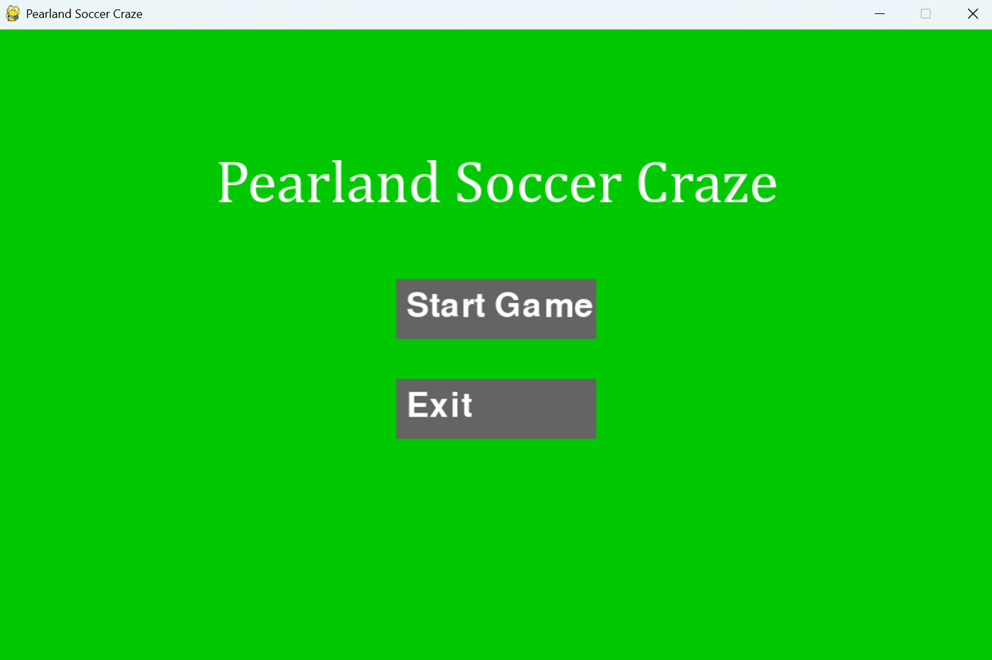
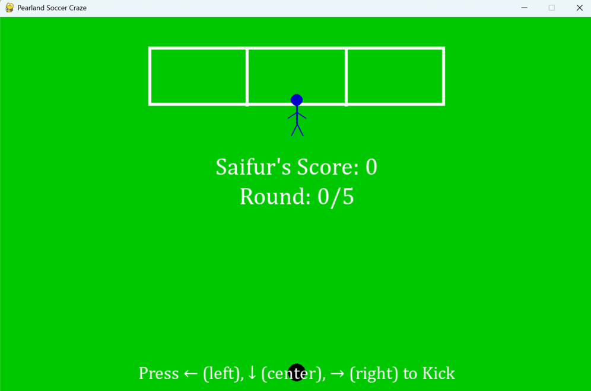

# Python-Pygame-game-project
A fullscreen Python/Pygame soccer penalty shootout game with player scoring, goalkeeper movement, sound effects, and a simple game menu.
# Pearland Soccer Craze

**Pearland Soccer Craze** is a simple fullscreen soccer penalty shootout game developed using **Python** and **Pygame**. The game allows a player to enter their name, take penalty kicks, compete against a randomly moving goalkeeper, and view the final score after five rounds.

## 🎮 Game Overview

In this game, the player takes penalty shots by choosing one of three directions:

* Left
* Center
* Right

The goalkeeper randomly chooses a direction to block the shot. If the player kicks in a different direction from the goalkeeper, the player scores a goal. If both choose the same direction, the goalkeeper saves the shot.

## ✨ Features

* Fullscreen soccer field interface
* Player name input screen
* Interactive menu with Start and Exit options
* Five-round penalty shootout gameplay
* Random goalkeeper movement
* Score tracking
* Game-over results screen
* Option to start a new player
* Sound effects for goals and saves
* Footer credit displayed in the game

## 🛠️ Technologies Used

* Python
* Pygame
* Random module
* Time module

## 📁 Required Files

Make sure the following sound files are included in the same folder as the Python script:

```text
goal.wav
save.wav
```

Without these files, the game may produce an error when loading the sound effects.

## 🚀 How to Run

First, install Pygame:

```bash
pip install pygame
```

Then run the game:

```bash
python main.py
```

## 🎯 How to Play

1. Start the game from the main menu.
2. Enter the player name.
3. Use the keyboard arrow keys to kick the ball:

   * Left arrow: kick left
   * Down arrow: kick center
   * Right arrow: kick right
4. The goalkeeper randomly jumps left, center, or right.
5. Score as many goals as possible in five rounds.
6. View your final score on the results screen.

## 📸 Screenshot

### Main Start Screen

### Main Game Screen


## 📌 Future Improvements

Possible future improvements include:

* Adding difficulty levels
* Adding multiple players and leaderboard history
* Improving graphics and animations
* Adding background music
* Adding pause and restart options
* Packaging the game as an executable file

## 👨‍💻 Developer

Developed by **Md. Saifur Rahman (Saif)**

## 📧 Contact

Email: [iamsaif07@gmail.com](mailto:iamsaif07@gmail.com)
